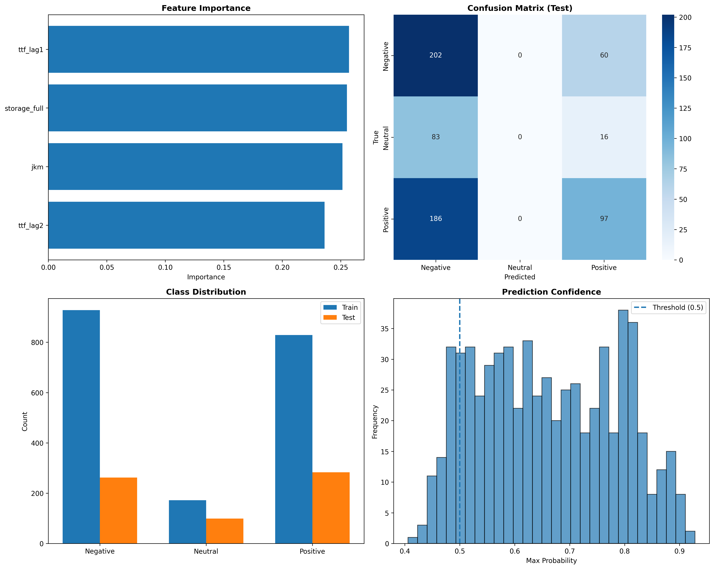
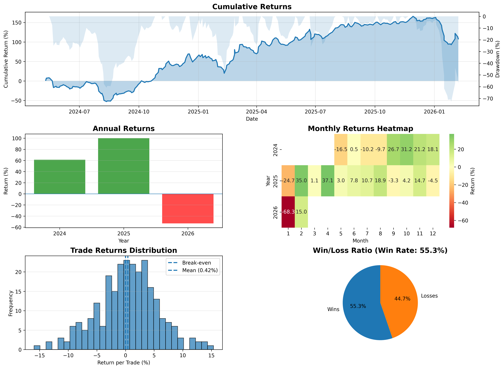

# A Trading Backtesting Framework for Energy Markets

A modular, extensible backtesting framework for TTF natural gas and EUA trading strategies in Python.

## Architecture

The framework is split into three main components:

### `models` - machine learning models for gas and emission markets

- **`XGBoostModel`**: ML-based strategy using model predictions
- **`LSMTModel`**: Simple time-based exit strategy

**Example for XGBoostModel:**

- **Target Variable**: 3-class classification
  - Class 2: Positive return (>1% over 5 days)
  - Class 1: Neutral return (-1% to 1% over 5 days)
  - Class 0: Negative return (<-1% over 5 days)

- **Features**:
  - TTF (Natural Gas prices)
  - API2 Coal prices
  - German Power prices
  - STOXX 600 index
  - EUA_lag1 (1-day lagged EUA price)
  - EUA_lag2 (2-day lagged EUA price)

### `strategies` - trading strategies
- **`MLPredictionStrategy`**: ML-based strategy using model predictions
- **`BollingerBandsStrategy`**: Simple bollinger banks strategy

**Example for MLPredictionStrategy:**
- **Signal Generation**: Model probability > 0.6 triggers trades
  - Long position: When probability of positive return > 0.6
  - Short position: When probability of negative return > 0.6
- **Position Management**:
  - Maximum 3 open positions at the same time
  - Hold period: 5 trading days
  - Automatic position closure after 5 days

### `backtester` - core backtesting engine
- **`Position`**: Represents individual trading positions with entry/exit tracking
- **`BaseStrategy`**: Abstract base class that all strategies must inherit from
- **`Backtester`**: Generic backtesting engine that executes any strategy
- **`visualize_backtest_results()`**: Creates comprehensive performance visualizations


**Performance Metrics**
- Monthly and annual returns
- Average return per trade
- Maximum profit and maximum loss per trade
- Win/loss count and win rate
- Cumulative returns over time

## Key Features

### Extensibility
- Add new strategies by inheriting from `BaseStrategy`
- Implement just 2 methods: `generate_signals()` and `should_close_position()`

### Flexibility
- Support for multiple concurrent positions
- Customizable position sizing
- Support for both long and short positions
- Metadata tracking for additional signal information
- Commissions and slippage customizable

### Comprehensive Analytics
- Win/loss statistics
- Cumulative returns
- Monthly and annual performance
- Trade distribution analysis
- Performance visualizations

## Usage

### 1. Prepare Your Data

Your data should be a CSV file or DataFrame with the following columns:
- `Date`: Trading date
- `ttf`: TTF prices
- `coal`: Coal prices
- `...`

Example CSV format:
```
Date,ttf,coal,power,stoxx,eua
2021-01-04,25.3,82.5,48.2,395.3,32.8
2021-01-05,26.1,83.1,49.1,398.1,33.2
...
```

### 2. Run the `main()` file

```bash
python main.py
```

## Output Files

The script generates three files in `/outputs/`:

1. **model_performance.png**: Visualization of model metrics
   - Feature importance
   - Confusion matrix
   - Class distribution
   - Prediction confidence distribution

2. **backtest_results.png**: Comprehensive backtest analysis
   - Cumulative returns over time
   - Annual returns bar chart
   - Monthly returns heatmap
   - Trade returns distribution
   - Win/loss ratio pie chart

3. **trades_log.csv**: Detailed log of all trades
   - Entry and exit dates
   - Entry and exit prices
   - Trade direction (long/short)
   - Model probability
   - Return percentage
   - P&L


## Customization

### Creating a Custom Strategy

```python
from backtester import BaseStrategy, Position
import pandas as pd

class MyCustomStrategy(BaseStrategy):
    def __init__(self, param1, param2):
        self.param1 = param1
        self.param2 = param2
    
    def generate_signals(self, df: pd.DataFrame, idx: int):
        """
        Return list of signals, e.g.:
        [{'direction': 'long', 'metadata': {'indicator_value': 0.75}}]
        """
        signals = []
        
        # Your signal logic here
        if self._should_buy(df, idx):
            signals.append({
                'direction': 'long',
                'metadata': {'reason': 'custom_indicator'}
            })
        
        return signals
    
    def should_close_position(self, position: Position, 
                             df: pd.DataFrame, current_idx: int):
        """
        Return True if position should be closed
        """
        # Your exit logic here
        bars_held = current_idx - position.entry_idx
        return bars_held >= 10
    
    def _should_buy(self, df, idx):
        # Your custom logic
        return False
```


## Example Output

### Model Performance
```
MODEL PERFORMANCE
============================================================

Train Accuracy: 0.7579
Test Accuracy: 0.4953
Cross-Validation Accuracy: 0.3298 (+/- 0.0723)

Classification Report (Test Set):
              precision    recall  f1-score   support

    Negative       0.45      0.77      0.57       262
     Neutral       0.00      0.00      0.00        99
    Positive       0.60      0.41      0.49       283

    accuracy                           0.50       644
   macro avg       0.35      0.39      0.35       644
weighted avg       0.45      0.50      0.45       644

```



### Backtest Results
```
BACKTEST RESULTS
============================================================

Total Trades: 257
Win Rate: 55.25%

Average Return per Trade: 0.42%
Average Return per Winning Trade: 4.11%
Average Return per Losing Trade: -4.14%

Max Return: 15.35%
Max Loss: -15.96%

ANNUAL RETURNS
------------------------------------------------------------
2024: 61.26%
2025: 100.01%
2026: -53.22%
```



## Important Notes

1. **Data Quality**: Ensure your data is clean with no missing values in critical columns
2. **Time-Series Split**: The model uses time-based train/test split to avoid look-ahead bias
3. **Backtesting on Test Data**: Only the test set is used for backtesting to simulate real-world performance
4. **Position Sizing**: The model assumes 100% capital allocation per trade


## Requirements

```
pandas
matplotlib
seaborn
scikit-learn
torch
optuna
```
